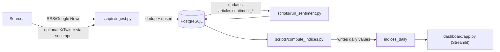

# Africa Momentum Index — MVP 

A lightweight data pipeline + Streamlit dashboard that tracks startup momentum across African countries from news (RSS/Google News) and optional social signals (X/Twitter via `snscrape`). Data lands in PostgreSQL (Neon-ready), daily indices are computed (momentum, maturity), and the app visualizes KPIs, trends, sentiment, and headlines.
> Countries in scope (MVP): Ghana (GH), Kenya (KE), Nigeria (NG)

## 🚀 Live Demo

[](https://africa-momentum-index-mvp.streamlit.app/)

---

## What you get

- **Sources**: RSS/Google News (primary); optional X/Twitter via `snscrape` (off by default).
- **Processing**: ingestion → VADER sentiment → daily per-country indices (momentum, maturity).
- **Storage**: PostgreSQL schema (Docker locally, Neon in the cloud).
- **App**: Streamlit KPIs, 7-day rolling trend, colored sentiment bars, latest headlines with links.
- **Ops**: Nightly refresh via GitHub Actions; optional in-app **Run demo** button to seed data.

## Quickstart (local via Docker)

```bash
make bootstrap
```

> Opens <http://localhost:8501> (Adminer at <http://localhost:8081> if enabled)

---

## Run steps individually

```bash
python -m scripts.ingest
python -m scripts.run_sentiment
python -m scripts.compute_indices
```

## Or all at once

```bash
make demo-local      # host → localhost:6543
# or inside the container
make demo-docker     # container → db:5432
```

## Data Model (MVP)

- `countries` (id, iso2, name)
- `articles` (id, country_id, source_name, sub_indicator, title, url, published_at, sentiment_label, sentiment_score, …)
- `social_posts` (optional tweets)
- `indices_daily` (country_id, date, momentum, maturity, drivers, computed_at)
- There’s a unique constraint on `(country_id, date)` in `indices_daily`.

---

## How the pipeline works



---

## Roadmap

- [ ] **Topic modeling** (emerging sectors)  
  Identify themes (e.g., agri-tech, health-tech) per country and trend them over time.
- [ ] **Correlations** (sentiment ↔ funding)  
  Join with venture/funding series to quantify lead/lag relationships.
- [ ] **Alerts** (big shifts)  
  Threshold/percentile-based notifications for sudden momentum or sentiment moves.
- [ ] **Geospatial layer** (funding hotspots)  
  Country/city heatmaps; optional `geopandas` layer for choropleths.
- [ ] **Multilingual sentiment** (AfriBERTa or similar)  
  Replace VADER baseline; evaluate accuracy across EN/FR/PT and local corpora.
- [ ] **Backtesting & QA**  
  Hold-out evaluation, confidence bands, and data-quality checks.
- [ ] **Ops**  
  Incremental ETL, idempotent re-runs, and observability (basic run logs/metrics).

---

## Acknowledgements

- **Content & Parsing:** Google News RSS, `feedparser`  
- **Social (optional):** `snscrape` (X/Twitter)  
- **NLP:** `vaderSentiment` (baseline; to be upgraded to AfriBERTa)  
- **App & Data:** Streamlit, pandas, Altair  
- **Storage & Access:** PostgreSQL, SQLAlchemy (Neon-ready)  
- **Dev UX:** Docker Compose, Adminer  
- **Automation:** GitHub Actions

*All product and company names are trademarks™ or registered® trademarks of their respective holders.*
